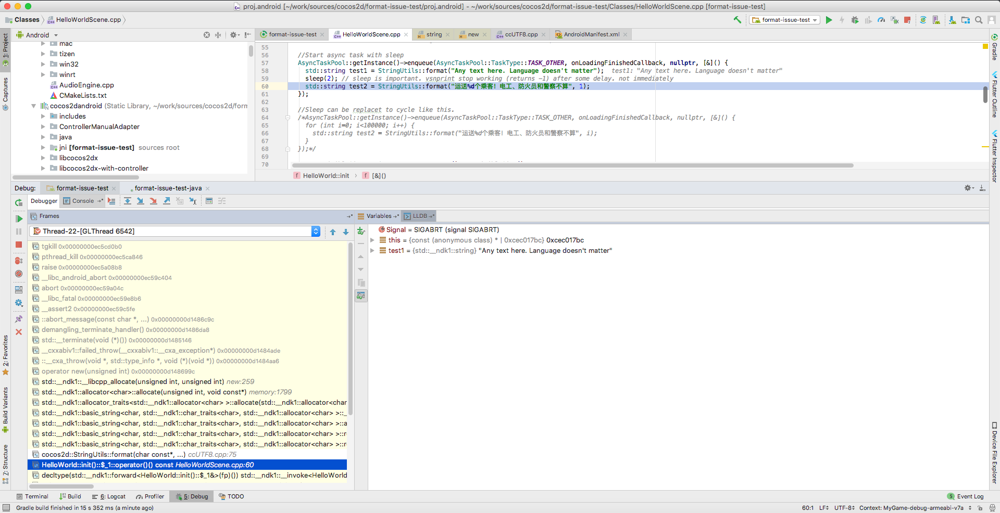
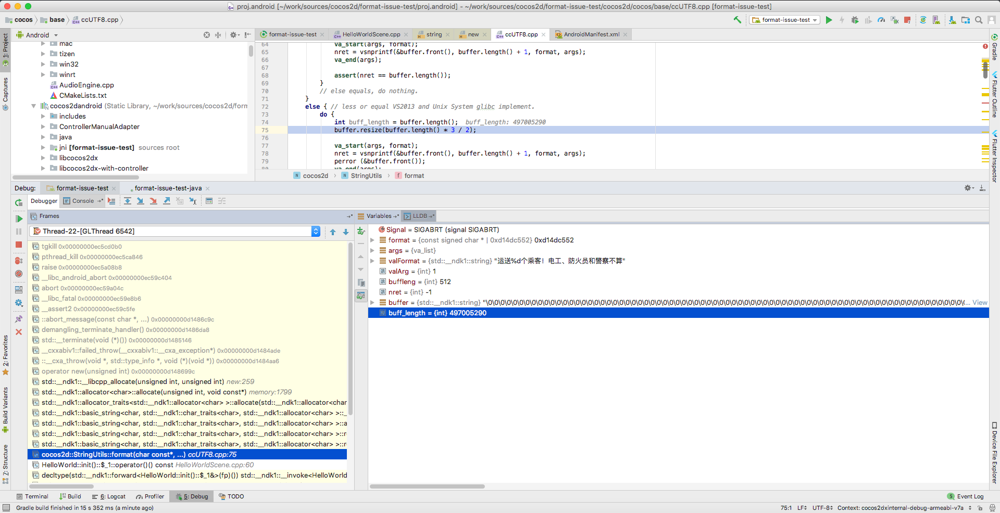

cocos2d-x format issue on Android
=========

On some android devices `StringUtils::format()` throw `SIGABRT` becouse `vsprintf` infiniatly returns -1. `StringUtils::format()` should be called inside AsyncTask for this.

Steps to reproduce:
1. Call `StringUtils::format()` inside AsyncTask
2. Call `StringUtils::format()` anywere else after some delay (1-2 sec).

Spec:
* cocos2d-x 3.17
* android ndk > 14 (with ndk14 everything is fine)

Affected devices (tested):
* Xiaomi Mi Pad 3 (Android 7)

Affected devices (top devices from crashlytics statistics):
* TCT (Alcatel) Alcatel 1X (U5A_PLUS_4G), Android 8.1
* Xiaomi Redmi 6A (cactus), Android 8.1
* Xiaomi Redmi 6 (cereus), Android 8.1
* Huawei Honor 7A (HWDUA-M), Android 8.1

Code to reproduce (with delay between calls to `StringUtils::format`):
```
//Async task callback
  std::function<void(void *)> onLoadingFinishedCallback = [this](void *param) { };

  //Start async task with sleep
  AsyncTaskPool::getInstance()->enqueue(AsyncTaskPool::TaskType::TASK_OTHER, onLoadingFinishedCallback, nullptr, [&]() {
    std::string test1 = StringUtils::format("Any text here. Language doesn't matter");
    sleep(2); // sleep is important. vsnprint stop working (returns -1) after some delay. not immediately
    std::string test2 = StringUtils::format("运送%d个乘客！电工、防火员和警察不算", 1);
  });
  ```

Code to reproduce (without delay):
```
  //Async task callback
  std::function<void(void *)> onLoadingFinishedCallback = [this](void *param) { };

  //Sleep can be replacet to cycle like this. 
  AsyncTaskPool::getInstance()->enqueue(AsyncTaskPool::TaskType::TASK_OTHER, onLoadingFinishedCallback, nullptr, [&]() {
    for (int i=0; i<100000; i++) {
      std::string test2 = StringUtils::format("运送%d个乘客！电工、防火员和警察不算", i);
    }
  });
  ```

Crash screenshots:



